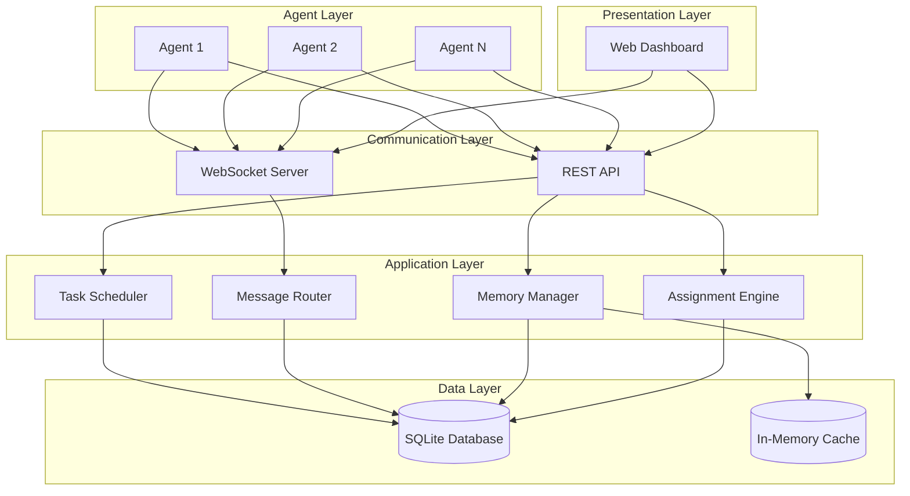
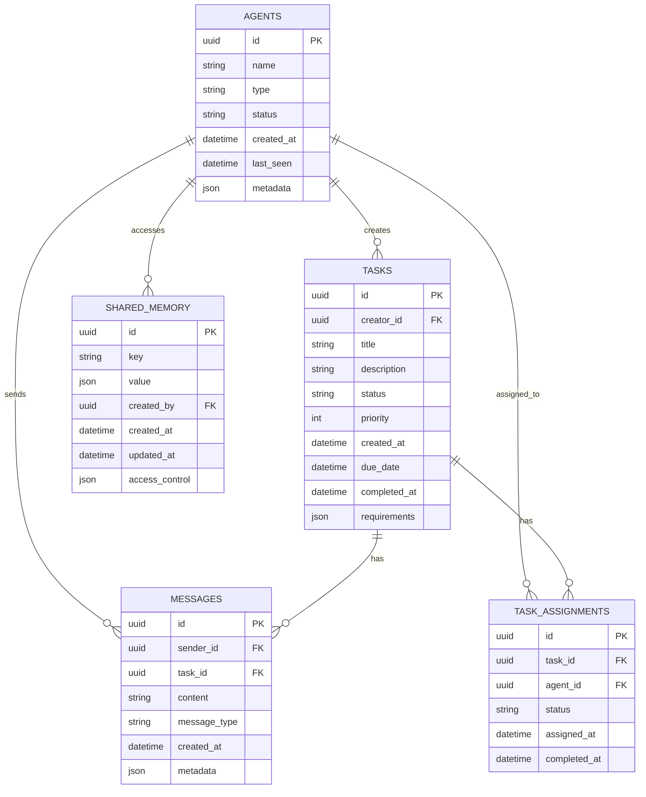

# Multi-Agent Communication Channel - Architecture Plan

## Overview
A local communication platform for Python-based AI/LLM agents to discuss, assign tasks, share memory, and track completion efficiently.

## System Architecture



## Technology Stack

| Layer | Technology | Purpose |
|-------|-----------|---------|
| Backend | FastAPI | High-performance async API framework |
| Real-time | WebSocket | Bidirectional agent communication |
| Database | SQLite | Local persistent storage |
| ORM | SQLAlchemy | Database abstraction |
| Frontend | React + TypeScript | Modern web dashboard |
| UI Library | shadcn/ui | Beautiful, accessible components |
| Real-time UI | Socket.IO | WebSocket client for dashboard |
| Agent SDK | Python | Client library for agents |

## Database Schema



## Core Components

### 1. Agent Communication Service
- WebSocket connection management
- Message routing between agents
- Agent presence tracking
- Connection state management

### 2. Task Management Service
- Task creation and assignment
- Task status tracking
- Priority-based scheduling
- Task dependency handling

### 3. Memory Sharing Service
- Shared key-value store
- Memory access control
- Memory versioning
- Memory synchronization

### 4. Assignment Engine
- Intelligent task assignment
- Agent capability matching
- Load balancing
- Task redistribution

### 5. Web Dashboard
- Real-time agent monitoring
- Task board view
- Message history
- Memory inspector
- System metrics

## API Endpoints

### Agent Management
- `POST /api/agents/register` - Register new agent
- `GET /api/agents` - List all agents
- `GET /api/agents/{id}` - Get agent details
- `PUT /api/agents/{id}/status` - Update agent status

### Messaging
- `POST /api/messages` - Send message
- `GET /api/messages` - List messages (filtered)
- `GET /api/messages/{id}` - Get message details

### Tasks
- `POST /api/tasks` - Create task
- `GET /api/tasks` - List tasks
- `GET /api/tasks/{id}` - Get task details
- `PUT /api/tasks/{id}` - Update task
- `POST /api/tasks/{id}/assign` - Assign task to agent
- `POST /api/tasks/{id}/complete` - Mark task complete

### Shared Memory
- `POST /api/memory` - Store shared memory
- `GET /api/memory/{key}` - Retrieve memory
- `PUT /api/memory/{key}` - Update memory
- `DELETE /api/memory/{key}` - Delete memory

## WebSocket Events

### Client → Server
- `agent:register` - Register agent connection
- `agent:heartbeat` - Keep-alive signal
- `message:send` - Send message to agents
- `task:create` - Create new task
- `task:assign` - Assign task
- `task:update` - Update task status
- `memory:set` - Set shared memory
- `memory:get` - Get shared memory

### Server → Client
- `message:received` - New message
- `task:assigned` - Task assigned to agent
- `task:updated` - Task status changed
- `memory:updated` - Memory changed
- `agent:joined` - Agent joined channel
- `agent:left` - Agent left channel

## Agent Client SDK

```python
# Example usage
from agent_sdk import AgentClient

# Initialize client
agent = AgentClient(
    name="research_agent",
    agent_type="llm",
    server_url="http://localhost:8000"
)

# Connect to server
await agent.connect()

# Send message
await agent.send_message(
    content="Starting research task...",
    recipients=["analysis_agent"]
)

# Create and assign task
task = await agent.create_task(
    title="Analyze data",
    description="Process the dataset",
    priority=1,
    assign_to="analysis_agent"
)

# Share memory
await agent.set_memory(
    key="research_results",
    value={"findings": "..."}
)

# Listen for messages
@agent.on_message
async def handle_message(message):
    print(f"Received: {message.content}")

# Listen for tasks
@agent.on_task_assigned
async def handle_task(task):
    result = await process_task(task)
    await agent.complete_task(task.id, result)
```

## Project Structure

```
communication-channel/
├── backend/
│   ├── app/
│   │   ├── api/
│   │   │   ├── agents.py
│   │   │   ├── messages.py
│   │   │   ├── tasks.py
│   │   │   └── memory.py
│   │   ├── core/
│   │   │   ├── config.py
│   │   │   ├── database.py
│   │   │   └── security.py
│   │   ├── models/
│   │   │   ├── agent.py
│   │   │   ├── message.py
│   │   │   ├── task.py
│   │   │   └── memory.py
│   │   ├── services/
│   │   │   ├── agent_service.py
│   │   │   ├── message_service.py
│   │   │   ├── task_service.py
│   │   │   └── memory_service.py
│   │   ├── websocket/
│   │   │   ├── connection_manager.py
│   │   │   └── events.py
│   │   └── main.py
│   ├── requirements.txt
│   └── alembic/
├── frontend/
│   ├── src/
│   │   ├── components/
│   │   ├── pages/
│   │   ├── hooks/
│   │   └── lib/
│   ├── package.json
│   └── vite.config.ts
├── agent-sdk/
│   ├── agent_sdk/
│   │   ├── __init__.py
│   │   ├── client.py
│   │   └── models.py
│   ├── setup.py
│   └── requirements.txt
├── docs/
│   ├── api.md
│   ├── sdk-guide.md
│   └── deployment.md
└── README.md
```

## Key Features

1. **Real-time Communication**: WebSocket-based messaging between agents
2. **Task Assignment**: Create, assign, and track tasks with priorities
3. **Shared Memory**: Key-value store for agents to share data
4. **Agent Discovery**: Register and discover available agents
5. **Status Tracking**: Monitor agent status and task completion
6. **Web Dashboard**: Visual interface for monitoring and management
7. **Checkmark System**: Visual indicators for task completion
8. **Persistent Storage**: SQLite database for all data
9. **Agent SDK**: Easy-to-use Python client library
10. **Extensible**: Plugin architecture for custom agent behaviors

## Implementation Phases

### Phase 1: Core Backend
- Database schema and models
- REST API endpoints
- Basic WebSocket support
- Agent registration

### Phase 2: Task & Memory Services
- Task creation and assignment
- Shared memory system
- Task status tracking

### Phase 3: Agent SDK
- Python client library
- WebSocket client
- Message handling
- Task management

### Phase 4: Web Dashboard
- React frontend
- Real-time updates
- Task board
- Agent monitoring

### Phase 5: Advanced Features
- Task dependencies
- Agent capabilities
- Load balancing
- Analytics and reporting